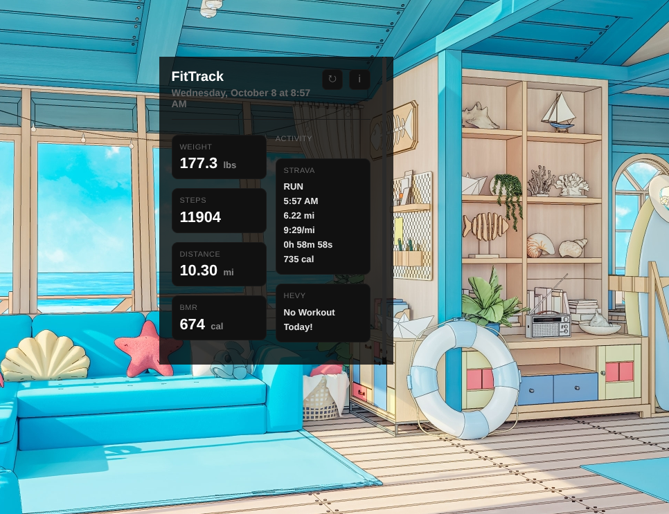
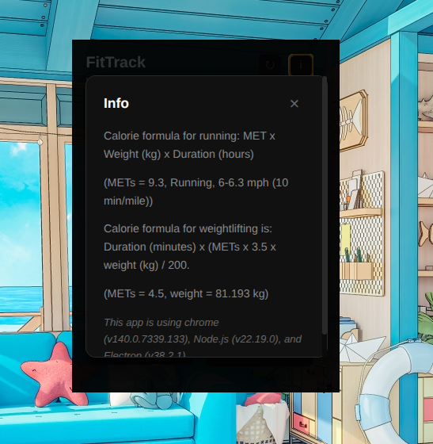
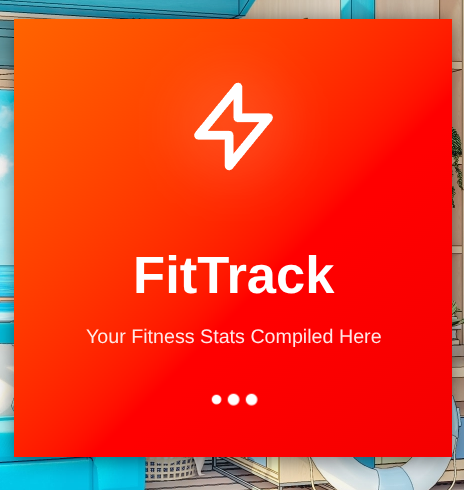

# FitTrack

Fitness Tracker that grabs activity data from Fitbit, Hevy, and Strava. 

Fitbit and Strava have a public api while Hevy is only available to Hevy Pros users and does not use support Auth2.0.


## Features

- Connect to Fitbit, Hevy, and Strava APIs and pull in user data  
- Unified dashboard to view combined metrics  
- Sync of steps / activity across APIs  
- Handle API tokens / authentication for each service  

## Screenshots








## Usage/Examples

  1. Launch the app

  2. Connect each service (Fitbit, Hevy, Strava) via OAuth

  3. Authorize scopes needed (activity, steps, etc.)

  4. The app fetches and displays aggregated fitness data

  5. Refresh or periodically sync to update stats

## Installation for users

  Click on the Releases on this page under the About Section or click this link: https://github.com/AbdallaAlhag/fitness-tracker-desktopApp/releases 

  Then open up the Assets of the latest version and install the .deb file (debian-based linux os like ubuntu, kali linux, and linux mint) or the .rpm file (red-hat based linux distro like Fedora, CentOS, etc...)

  Authorize Strava and Fitbit authentication and you should be good to go.

  Window and macos version come soon (maybe lol)

## Installation for developers

### Prerequisites

- Node.js (v16+ recommended)

- npm

- Accounts & API access for Fitbit, Hevy, Strava

```bash
    git clone https://github.com/AbdallaAlhag/fitness-tracker-desktopApp.git
    cd fitness-tracker-desktopApp
    npm install
```

## Environment Variables

Set up An API account with Strava, Fitbit, And Hevy 


To run this project, you will need to add the following environment variables to your .env file.

I have a development and production .env.
Redirect uri in production is "myapp://auth/callback" while development it is "http://localhost:3000/callback" 

Configure Forge.config.js to ensure build settings are correct and check package.json for running scripts like start, make, and publish.

`FITBIT_CLIENT_ID`

`FITBIT_CLIENT_SECRET`

`FITBIT_REDIRECT_URI` 

`STRAVA_CLIENT_ID` 

`STRAVA_CLIENT_SECRET` 

`STRAVA_REDIRECT_URI`

`HEVY_API_KEY`

`GH_TOKEN`(Not related to api)

Configure Forge.config.js to ensure build settings are correct and check package.json for running scripts like start, make, and publish.

## Tech Stack

**Frontend / UI:** ReHTML, CSS, JavaScript

**Backend / Electron:** Node.js, Electron Forge

**APIs:** Fitbit Web API, Strava API, Hevy (if available)


## Acknowledgements

 - [Fitbit API docs](https://dev.fitbit.com/build/reference/)
 - [Strava API docs](https://developers.strava.com/)
 - [Hevy API docs](https://api.hevyapp.com/docs/)
 - [Fan made FitBit Dashboard](https://github.com/jlai/fitness-dashboard/)  

